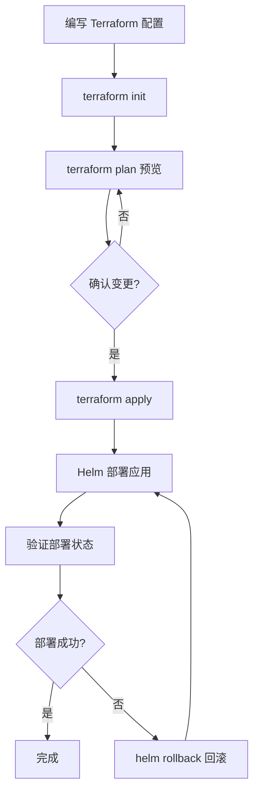
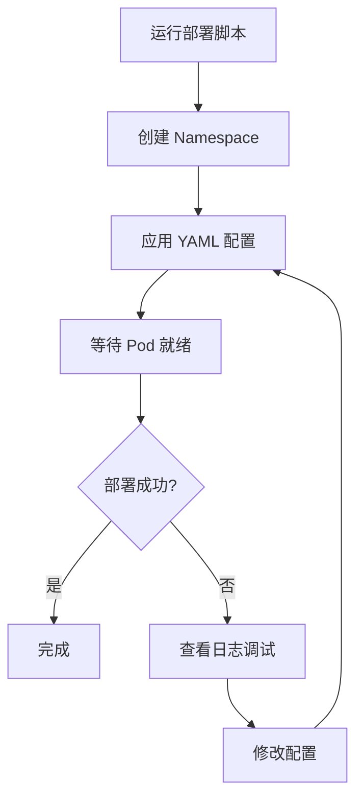

# ES Serverless 部署指南

本项目提供两种独立的部署方式，根据您的使用场景选择合适的方式。

## 📦 两种部署方式对比

### 🔧 方式一：Terraform + Helm（推荐生产环境）

**目录**: [`deployment-terraform/`](deployment-terraform/)

**技术栈**:
- Terraform: 基础设施即代码（IaC）
- Helm: Kubernetes 应用包管理
- Kubernetes Provider

**适用场景**:
- ✅ 生产环境部署
- ✅ 多租户大规模集群
- ✅ 需要审计和合规
- ✅ 团队协作开发
- ✅ 跨云平台部署

**核心优势**:
| 优势 | 说明 |
|------|------|
| 🔄 状态管理 | Terraform 自动追踪资源状态，支持增量更新 |
| 📜 声明式配置 | 代码即文档，配置版本可控 |
| 🔙 回滚能力 | Helm 支持一键回滚到历史版本 |
| 🧩 模块化 | Terraform 模块复用，轻松管理多租户 |
| 🌐 多云支持 | 同一套配置适配 AWS/GCP/Azure |
| 📊 审计追踪 | 所有变更可追溯，满足合规要求 |

**快速开始**:
```bash
cd deployment-terraform/terraform
terraform init
terraform plan
terraform apply
```

👉 [详细文档](deployment-terraform/README.md)

---

### 🚀 方式二：Shell 脚本（推荐开发测试）

**目录**: [`deployment-scripts/`](deployment-scripts/)

**技术栈**:
- Bash Shell 脚本
- Kubernetes YAML 清单
- kubectl 命令行工具

**适用场景**:
- ✅ 本地开发环境
- ✅ 快速功能验证
- ✅ 学习和实验
- ✅ POC 概念验证
- ✅ CI/CD 集成测试

**核心优势**:
| 优势 | 说明 |
|------|------|
| 🎯 简单直接 | 无需学习额外工具，Shell 脚本即可 |
| ⚡ 快速部署 | 一键脚本，几分钟内完成部署 |
| 🔍 易于调试 | 直接查看 YAML 配置，容易排查问题 |
| 📦 轻量级 | 只需 kubectl，无额外依赖 |
| 🛠️ 灵活定制 | 脚本易修改，适合快速迭代 |
| 📚 学习友好 | 透明的部署流程，便于理解原理 |

**快速开始**:
```bash
cd deployment-scripts
./scripts/deploy.sh install
```

👉 [详细文档](deployment-scripts/README.md)

---

## 🎯 如何选择？

### 决策树

```
需要部署的环境是？
│
├─ 生产环境
│   └─ 使用 Terraform + Helm ✅
│       - 多租户隔离
│       - 资源配额管理
│       - 审计和合规
│       - 状态管理和回滚
│
├─ 开发/测试环境
│   └─ 使用 Shell 脚本 ✅
│       - 快速部署验证
│       - 灵活调试修改
│       - 无需状态管理
│
└─ 学习 Kubernetes
    └─ 使用 Shell 脚本 ✅
        - 透明的 YAML 配置
        - 理解底层原理
        - 易于实验
```

### 功能对比表

| 功能特性 | Terraform+Helm | Shell 脚本 | 说明 |
|---------|---------------|-----------|------|
| **部署速度** | ⭐⭐⭐ | ⭐⭐⭐⭐⭐ | 脚本更快，无需状态检查 |
| **学习曲线** | ⭐⭐⭐ | ⭐⭐⭐⭐⭐ | 脚本只需 Shell 知识 |
| **生产可靠性** | ⭐⭐⭐⭐⭐ | ⭐⭐⭐ | Terraform 有状态管理 |
| **回滚能力** | ⭐⭐⭐⭐⭐ | ⭐⭐ | Helm 支持版本回滚 |
| **多租户管理** | ⭐⭐⭐⭐⭐ | ⭐⭐⭐ | Terraform 模块化管理 |
| **配置复杂度** | ⭐⭐⭐ | ⭐⭐⭐⭐⭐ | YAML 更直观 |
| **团队协作** | ⭐⭐⭐⭐⭐ | ⭐⭐ | Terraform 有锁机制 |
| **审计追踪** | ⭐⭐⭐⭐⭐ | ⭐ | Terraform 状态文件 |
| **调试难度** | ⭐⭐⭐ | ⭐⭐⭐⭐⭐ | 脚本输出更直接 |
| **维护成本** | ⭐⭐⭐⭐ | ⭐⭐⭐ | 声明式 vs 命令式 |

---

## 📋 两种方式的部署流程对比

### Terraform + Helm 流程



### Shell 脚本流程



---

## 🚀 常见部署场景

### 场景 1: 本地开发测试

**推荐**: Shell 脚本

```bash
# 使用 Docker Desktop Kubernetes
cd deployment-scripts
./scripts/deploy.sh install

# 访问服务
kubectl -n es-serverless port-forward svc/elasticsearch 9200:9200
curl http://localhost:9200
```

**时间**: ~5 分钟

---

### 场景 2: 生产环境部署（单租户）

**推荐**: Terraform + Helm

```bash
cd deployment-terraform/terraform

# 配置变量
cat > terraform.tfvars <<EOF
elasticsearch_replicas = 5
elasticsearch_storage_size = "100Gi"
gpu_enabled = true
EOF

# 部署
terraform init
terraform apply
```

**时间**: ~15 分钟（包含状态检查）

---

### 场景 3: 多租户环境

**推荐**: Terraform + Helm

```bash
# terraform/main.tf
module "tenant_alice" {
  source = "./modules/tenant"
  tenant_org_id = "org-001"
  user = "alice"
  service_name = "vector-search"
  replicas = 3
}

module "tenant_bob" {
  source = "./modules/tenant"
  tenant_org_id = "org-002"
  user = "bob"
  service_name = "text-search"
  replicas = 2
}

terraform apply
```

**优势**:
- ✅ 模块复用，一致性配置
- ✅ 自动资源配额和网络隔离
- ✅ 统一状态管理

---

### 场景 4: CI/CD 集成

**Shell 脚本集成 GitLab CI**:

```yaml
# .gitlab-ci.yml
deploy:
  stage: deploy
  script:
    - cd deployment-scripts
    - ./scripts/deploy.sh install
  environment:
    name: development
```

**Terraform 集成 GitHub Actions**:

```yaml
# .github/workflows/deploy.yml
name: Deploy
on:
  push:
    branches: [main]
jobs:
  terraform:
    runs-on: ubuntu-latest
    steps:
      - uses: hashicorp/setup-terraform@v2
      - run: terraform init
      - run: terraform apply -auto-approve
```

---

## 🔄 迁移指南

### 从脚本迁移到 Terraform

如果您当前使用脚本部署，想要迁移到 Terraform：

```bash
# 1. 导出现有配置
kubectl get all -n es-serverless -o yaml > existing-config.yaml

# 2. 使用 Terraform import
cd deployment-terraform/terraform
terraform import kubernetes_namespace.main es-serverless

# 3. 逐步迁移资源
terraform import kubernetes_statefulset.elasticsearch es-serverless/elasticsearch

# 4. 验证状态
terraform plan  # 应该显示 "No changes"

# 5. 后续使用 Terraform 管理
terraform apply
```

### 从 Terraform 迁移到脚本

如果想要简化为脚本部署：

```bash
# 1. 使用 Terraform 生成 YAML
cd deployment-terraform/terraform
terraform show -json | jq '...' > k8s-config.yaml

# 2. 删除 Terraform 状态（可选）
terraform destroy  # 保留资源，只删除状态

# 3. 使用脚本接管
cd deployment-scripts
kubectl apply -f k8s-config.yaml
```

---

## 🛠️ 工具准备

### Terraform + Helm 所需工具

```bash
# macOS
brew install terraform kubectl helm

# Linux
curl -fsSL https://apt.releases.hashicorp.com/gpg | sudo apt-key add -
sudo apt-add-repository "deb [arch=amd64] https://apt.releases.hashicorp.com $(lsb_release -cs) main"
sudo apt-get update && sudo apt-get install terraform

curl https://baltocdn.com/helm/signing.asc | gpg --dearmor | sudo tee /usr/share/keyrings/helm.gpg > /dev/null
echo "deb [arch=$(dpkg --print-architecture) signed-by=/usr/share/keyrings/helm.gpg] https://baltocdn.com/helm/stable/debian/ all main" | sudo tee /etc/apt/sources.list.d/helm-stable-debian.list
sudo apt-get update && sudo apt-get install helm
```

### Shell 脚本所需工具

```bash
# 仅需 kubectl
brew install kubectl  # macOS

# Linux
curl -LO "https://dl.k8s.io/release/$(curl -L -s https://dl.k8s.io/release/stable.txt)/bin/linux/amd64/kubectl"
sudo install -o root -g root -m 0755 kubectl /usr/local/bin/kubectl
```

---

## 📚 相关文档

- [Terraform + Helm 详细文档](deployment-terraform/README.md)
- [Shell 脚本详细文档](deployment-scripts/README.md)
- [架构设计文档](docs/architecture.md)
- [多租户架构说明](docs/多租户架构说明.md)
- [GPU 加速配置](es-plugin/README.md)

---

## ❓ 常见问题

### Q: 可以混用两种部署方式吗？

**不推荐**。两种方式管理同一个集群会导致状态冲突。选择一种方式并坚持使用。

### Q: 已有集群能否切换部署方式？

**可以**，但需要小心：
1. 导出现有配置
2. 使用新方式导入资源
3. 验证状态一致性
4. 逐步迁移

参考上方的 [迁移指南](#迁移指南)。

### Q: 生产环境能否使用脚本？

**不推荐**。脚本缺少：
- 状态管理（容易配置漂移）
- 回滚能力（故障恢复困难）
- 审计追踪（不满足合规要求）

建议生产环境使用 Terraform + Helm。

### Q: 开发环境需要 Terraform 吗？

**不必要**。本地开发使用脚本更快捷：
- 无需维护状态文件
- 修改即刻生效
- 调试更直观

---

## 📞 获取帮助

- 查看部署方式文档:
  - [Terraform + Helm](deployment-terraform/README.md)
  - [Shell 脚本](deployment-scripts/README.md)

- 项目 Issues: [GitHub Issues](https://github.com/your-org/es-paas/issues)
- 架构文档: [docs/architecture.md](docs/architecture.md)

---

**选择合适的部署方式，开始您的 ES Serverless 之旅！** 🚀
