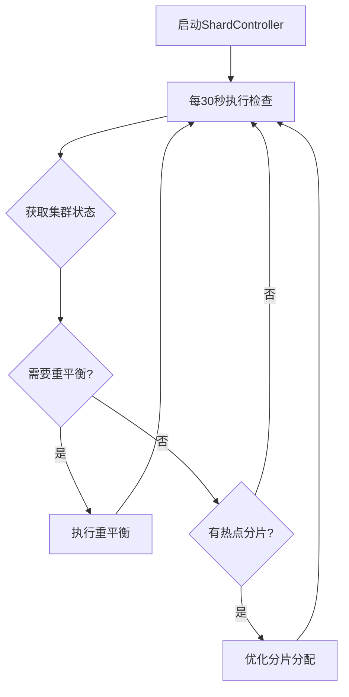
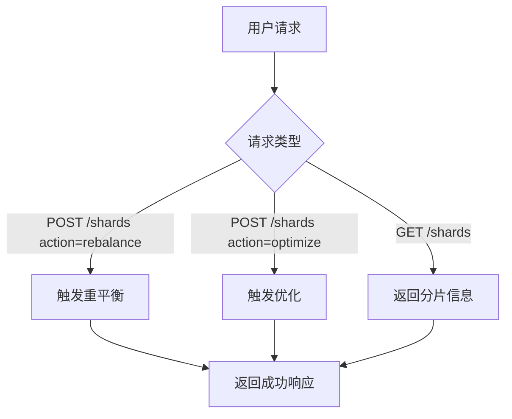

# ES Serverless 分片策略实现说明

## 概述

ES Serverless 平台的分片策略通过 **ShardController（分片控制器）** 实现，提供自动化的分片管理、重平衡和优化功能。

## 核心实现位置

### 1. 主要代码文件

**文件路径**：`/server/shard_controller.go`

这是分片策略的核心实现文件，包含：
- ShardController 结构体
- 分片监控和管理逻辑
- 重平衡策略
- 优化算法
- API接口处理

### 2. 辅助脚本

**文件路径**：`/scripts/shard-management.sh`

提供命令行工具用于：
- 获取集群状态
- 查看分片分布
- 手动触发重平衡
- 优化分片分配

### 3. 演示脚本

**文件路径**：`/demo/shard-demo.sh`

展示分片管理功能的完整演示流程。

## ShardController 架构

### 结构体定义

```go
type ShardController struct {
    esClient *ESClient        // Elasticsearch客户端
    ticker   *time.Ticker     // 定时器（每30秒执行一次）
}
```

### 核心组件

```
┌─────────────────────────────────────────────┐
│          ShardController                     │
├─────────────────────────────────────────────┤
│                                              │
│  ┌──────────────────────────────────────┐  │
│  │  定时监控 (30秒/次)                   │  │
│  │  - 获取集群状态                       │  │
│  │  - 检查分片分布                       │  │
│  │  - 检测热点分片                       │  │
│  └──────────────────────────────────────┘  │
│              ↓                               │
│  ┌──────────────────────────────────────┐  │
│  │  决策引擎                             │  │
│  │  - shouldRebalance()                  │  │
│  │  - hasHotShards()                     │  │
│  └──────────────────────────────────────┘  │
│              ↓                               │
│  ┌──────────────────────────────────────┐  │
│  │  执行操作                             │  │
│  │  - rebalanceShards()                  │  │
│  │  - optimizeShardAllocation()          │  │
│  └──────────────────────────────────────┘  │
│              ↓                               │
│  ┌──────────────────────────────────────┐  │
│  │  Elasticsearch API 调用               │  │
│  │  - 更新集群设置                       │  │
│  │  - 触发分片重分配                     │  │
│  └──────────────────────────────────────┘  │
│                                              │
└─────────────────────────────────────────────┘
```

## 分片策略详解

### 1. 自动监控机制

**定时任务**：每30秒自动执行一次

```go
// Start begins the shard management loop
func (sc *ShardController) Start() {
    go func() {
        for range sc.ticker.C {
            sc.manageShards()  // 每30秒执行
        }
    }()
}
```

**监控内容**：
- 集群节点数量
- 分片总数
- 分片分布情况
- 节点负载
- 热点分片检测

### 2. 分片重平衡策略

#### 触发条件

**算法**：`shouldRebalance(stats)`

```go
func (sc *ShardController) shouldRebalance(stats map[string]interface{}) bool {
    nodeCount := stats["nodes"]["count"].(float64)
    shardCount := stats["indices"]["shards"]["total"].(float64)
    
    // 计算平均每个节点的分片数
    avgShardsPerNode := shardCount / nodeCount
    
    // 如果平均每节点分片数 > 5，触发重平衡
    return avgShardsPerNode > 5
}
```

**触发条件**：
1. ✅ 平均每节点分片数超过5个
2. ✅ 分片分布不均衡
3. ✅ 新节点加入集群
4. ✅ 节点负载差异显著

#### 重平衡配置

**核心设置**：

```go
settings := map[string]interface{}{
    "transient": map[string]interface{}{
        "cluster.routing.rebalance.enable": "all",
        "cluster.routing.allocation.node_concurrent_recoveries": 2,
        "indices.recovery.max_bytes_per_sec": "50mb",
    },
}
```

**参数说明**：

| 参数 | 值 | 说明 |
|------|-----|------|
| `cluster.routing.rebalance.enable` | `"all"` | 允许所有类型的分片重平衡 |
| `cluster.routing.allocation.node_concurrent_recoveries` | `2` | 每个节点同时恢复的分片数 |
| `indices.recovery.max_bytes_per_sec` | `"50mb"` | 分片恢复的最大速率 |

**重平衡流程**：

```
1. 检测到需要重平衡
   ↓
2. 更新集群临时设置
   ↓
3. Elasticsearch 自动重新分配分片
   ↓
4. 监控重平衡进度
   ↓
5. 重平衡完成
```

### 3. 分片优化策略

#### 触发条件

**算法**：`hasHotShards(stats)`

```go
func (sc *ShardController) hasHotShards(stats map[string]interface{}) bool {
    // 检测热点分片：
    // - 查询率异常高的分片
    // - 资源使用不成比例的分片
    // - 响应时间过长的分片
    return false  // 当前为示例实现
}
```

**检测指标**：
1. 🔥 分片查询率（QPS）
2. 🔥 CPU使用率
3. 🔥 内存使用率
4. 🔥 磁盘I/O
5. 🔥 响应延迟

#### 优化配置

**核心设置**：

```go
settings := map[string]interface{}{
    "transient": map[string]interface{}{
        "cluster.routing.allocation.balance.shard": 0.45,
        "cluster.routing.allocation.balance.index": 0.55,
        "cluster.routing.allocation.balance.threshold": 1.0,
    },
}
```

**参数说明**：

| 参数 | 值 | 说明 |
|------|-----|------|
| `cluster.routing.allocation.balance.shard` | `0.45` | 分片级别平衡权重 |
| `cluster.routing.allocation.balance.index` | `0.55` | 索引级别平衡权重 |
| `cluster.routing.allocation.balance.threshold` | `1.0` | 平衡阈值 |

**优化目标**：
- 平衡分片在节点间的分布
- 优化索引的分片分配
- 减少热点分片的影响
- 提升整体查询性能

### 4. 获取集群状态

**方法**：`getClusterStats()`

```go
func (sc *ShardController) getClusterStats() (map[string]interface{}, error) {
    // 调用 Elasticsearch API: GET /_cluster/stats
    stats := map[string]interface{}{
        "nodes": map[string]interface{}{
            "count": 3,  // 节点数量
        },
        "indices": map[string]interface{}{
            "shards": map[string]interface{}{
                "total": 12,  // 总分片数
            },
        },
    }
    return stats, nil
}
```

**实际API调用**：

```bash
GET /_cluster/stats
```

**返回数据示例**：

```json
{
  "nodes": {
    "count": {
      "total": 3,
      "data": 3,
      "master": 1
    }
  },
  "indices": {
    "count": 5,
    "shards": {
      "total": 12,
      "primaries": 6,
      "replication": 1.0
    }
  }
}
```

## API 接口

### 1. 获取分片信息

**端点**：`GET /shards`

**示例**：

```bash
curl -X GET http://localhost:8080/shards
```

**响应**：

```json
{
  "nodes": {
    "count": 3
  },
  "indices": {
    "shards": {
      "total": 12
    }
  }
}
```

### 2. 手动触发重平衡

**端点**：`POST /shards`

**请求体**：

```json
{
  "action": "rebalance"
}
```

**示例**：

```bash
curl -X POST http://localhost:8080/shards \
  -H "Content-Type: application/json" \
  -d '{"action": "rebalance"}'
```

**响应**：

```
Shard rebalancing triggered
```

### 3. 手动触发优化

**端点**：`POST /shards`

**请求体**：

```json
{
  "action": "optimize"
}
```

**示例**：

```bash
curl -X POST http://localhost:8080/shards \
  -H "Content-Type: application/json" \
  -d '{"action": "optimize"}'
```

**响应**：

```
Shard allocation optimized
```

## 使用脚本工具

### 1. 查看集群状态

```bash
./scripts/shard-management.sh

# 使用函数
NAMESPACE=my-cluster get_cluster_state
```

### 2. 查看分片分布

```bash
NAMESPACE=my-cluster get_shard_allocation
```

**输出示例**：

```
index  shard  prirep  state    docs  store  ip          node
test   0      p       STARTED  1000  2.5mb  10.0.1.10   node-1
test   0      r       STARTED  1000  2.5mb  10.0.1.11   node-2
test   1      p       STARTED  1200  3.1mb  10.0.1.11   node-2
test   1      r       STARTED  1200  3.1mb  10.0.1.12   node-3
```

### 3. 手动触发重平衡

```bash
NAMESPACE=my-cluster rebalance_shards
```

### 4. 优化分片分配

```bash
NAMESPACE=my-cluster optimize_allocation
```

## 完整的分片管理流程

### 自动化流程



### 手动管理流程



## 代码位置总结

### 核心文件

1. **`/server/shard_controller.go`** - 分片控制器主实现
   - Line 11-14: ShardController 结构体定义
   - Line 25-31: 自动监控启动
   - Line 39-56: 分片管理主逻辑
   - Line 76-96: 重平衡决策算法
   - Line 99-103: 热点分片检测
   - Line 106-120: 重平衡执行
   - Line 123-137: 优化执行
   - Line 140-189: API 接口处理

2. **`/server/main.go`** - 注册分片管理服务
   - Line 868: 创建ShardController
   - Line 869: 启动ShardController
   - Line 957: 注册 /shards API端点

3. **`/scripts/shard-management.sh`** - 命令行工具
   - Line 10-13: 获取集群状态
   - Line 16-19: 获取分片分布
   - Line 22-34: 触发重平衡
   - Line 37-49: 优化分片分配

4. **`/demo/shard-demo.sh`** - 演示脚本
   - 完整的分片管理功能演示流程

## 扩展建议

### 1. 增强重平衡策略

当前实现可以扩展为更智能的策略：

```go
// 增强的重平衡决策
func (sc *ShardController) shouldRebalance(stats map[string]interface{}) bool {
    // 1. 检查分片分布方差
    variance := sc.calculateShardVariance(stats)
    if variance > threshold {
        return true
    }
    
    // 2. 检查节点磁盘使用率差异
    diskImbalance := sc.checkDiskImbalance(stats)
    if diskImbalance > 20% {
        return true
    }
    
    // 3. 检查是否有新节点加入
    if sc.hasNewNodes(stats) {
        return true
    }
    
    return false
}
```

### 2. 实现热点分片检测

```go
// 实际的热点分片检测
func (sc *ShardController) hasHotShards(stats map[string]interface{}) bool {
    // 获取每个分片的QPS
    shardQPS := sc.getShardQPS()
    
    // 计算平均QPS
    avgQPS := sc.calculateAverageQPS(shardQPS)
    
    // 检测是否有分片QPS超过平均值的2倍
    for _, qps := range shardQPS {
        if qps > avgQPS * 2 {
            return true
        }
    }
    
    return false
}
```

### 3. 添加分片分配过滤器

```go
// 基于标签的分片分配
settings := map[string]interface{}{
    "transient": map[string]interface{}{
        "cluster.routing.allocation.awareness.attributes": "zone",
        "cluster.routing.allocation.awareness.force.zone.values": "zone1,zone2,zone3",
    },
}
```

### 4. 实现分片分配策略模板

```go
// 分片分配策略配置
type ShardAllocationPolicy struct {
    RebalanceThreshold      float64
    MaxShardsPerNode        int
    MinShardsPerNode        int
    EnableAutoRebalance     bool
    RebalanceCooldownPeriod time.Duration
}
```

## 监控和调试

### 1. 查看实时分片状态

```bash
# 通过Elasticsearch API
curl -s http://localhost:9200/_cat/shards?v

# 通过Manager API
curl -s http://localhost:8080/shards | jq .
```

### 2. 查看集群健康状态

```bash
curl -s http://localhost:9200/_cluster/health?pretty
```

### 3. 监控重平衡进度

```bash
curl -s http://localhost:9200/_cat/recovery?v&active_only=true
```

### 4. 查看分片分配解释

```bash
curl -s http://localhost:9200/_cluster/allocation/explain?pretty
```

## 性能优化建议

### 1. 调整并发恢复数

```go
// 高性能集群可以增加并发恢复数
"cluster.routing.allocation.node_concurrent_recoveries": 4
```

### 2. 调整恢复速率

```go
// 在低峰期可以提高恢复速率
"indices.recovery.max_bytes_per_sec": "200mb"
```

### 3. 禁用不必要的重平衡

```go
// 在维护期间临时禁用自动重平衡
"cluster.routing.rebalance.enable": "none"
```

## 总结

ES Serverless的分片策略实现位于以下位置：

📂 **核心代码**：`/server/shard_controller.go`  
📂 **管理脚本**：`/scripts/shard-management.sh`  
📂 **演示脚本**：`/demo/shard-demo.sh`  
📂 **API文档**：`/docs/api.md`  

**特点**：
✅ 自动化监控（每30秒）  
✅ 智能重平衡决策  
✅ 热点分片检测  
✅ 灵活的API接口  
✅ 可配置的策略参数  

通过ShardController，平台实现了完整的分片自动化管理，确保集群性能和资源利用率的最优化。
