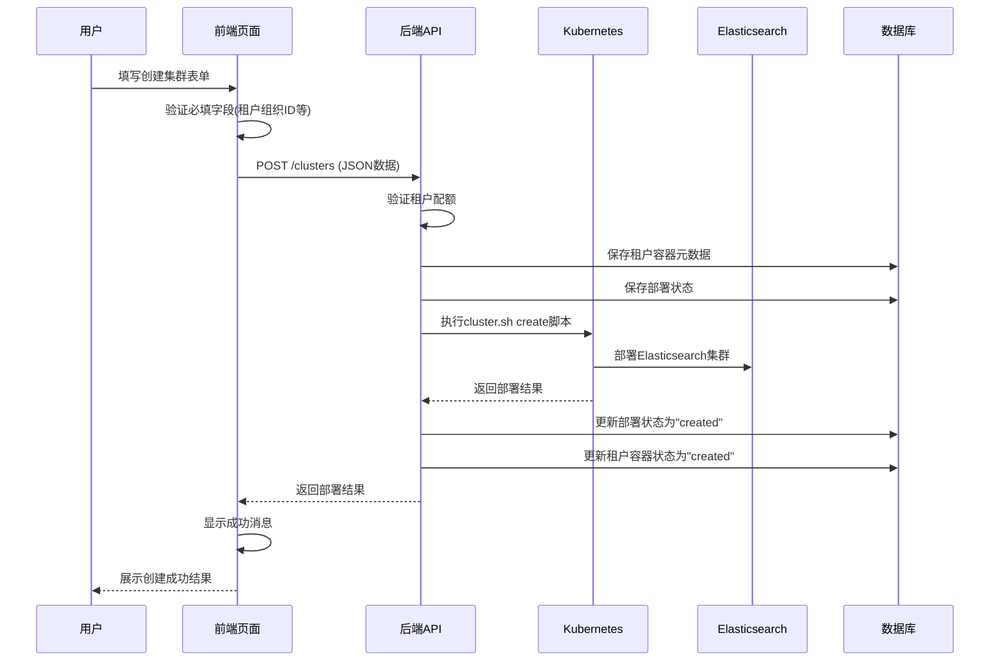
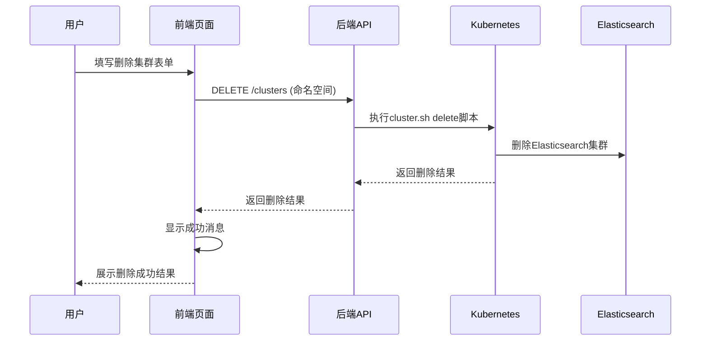
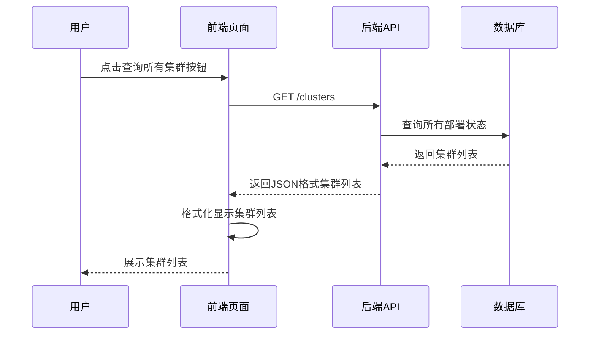
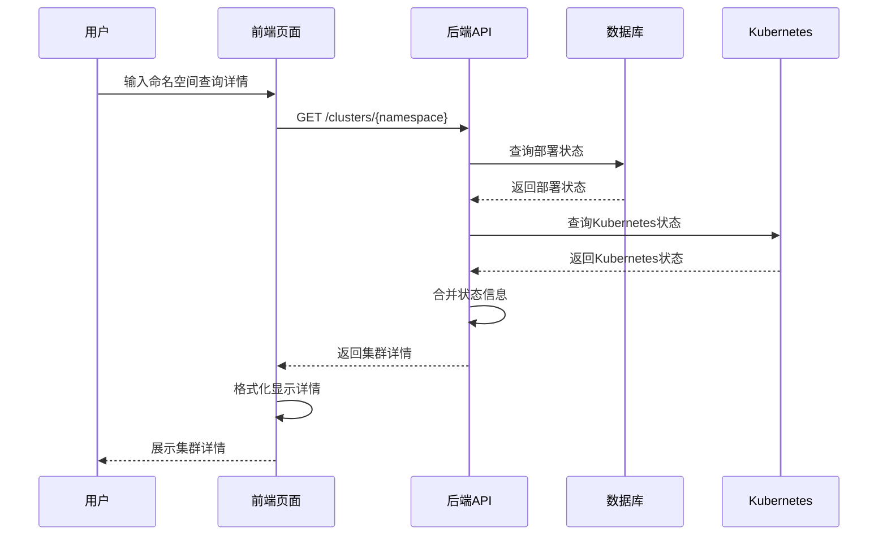

# 前端与后端交互时序图

## 1. 创建集群流程

## 2. 删除集群流程

## 3. 查询所有集群流程

## 4. 查询集群详情流程

## 5. API接口说明

### 5.1 创建集群
- **URL**: `POST /clusters`
- **参数**: 
  - tenant_org_id (必填): 租户组织ID
  - user (必填): 用户
  - service_name (必填): 服务名称
  - namespace (可选): 命名空间
  - replicas: 副本数
  - cpu_request: CPU请求
  - cpu_limit: CPU限制
  - mem_request: 内存请求
  - mem_limit: 内存限制
  - disk_size: 磁盘大小
  - gpu_count: GPU数量
  - dimension: 向量维度
  - vector_count: 向量数量
  - index_limit: 索引限制
  - gitlab_url: GitLab URL
- **响应**: 部署结果

### 5.2 删除集群
- **URL**: `DELETE /clusters`
- **参数**: 
  - namespace (必填): 命名空间
- **响应**: 删除结果

### 5.3 查询所有集群
- **URL**: `GET /clusters`
- **参数**: 无
- **响应**: 集群列表JSON

### 5.4 查询集群详情
- **URL**: `GET /clusters/{namespace}`
- **参数**: namespace (路径参数)
- **响应**: 集群详情JSON